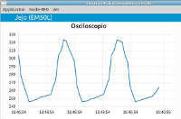
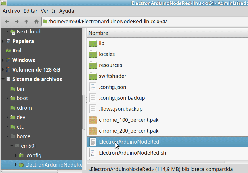

# ElectronArduinoNodeRed (EM50L)
https://github.com/EM50L/ElectronArduinoNodeRed

Esta es una plantilla que integra Node-Red arduino Firmdata y un panel de control (dashboard) en el Framework de ElectronJs
Nos va ha permitir poder interactuar el arduino con otros elementos iot como alexa telegram dashboard etc... 

This is an Electron template to embed Node-RED with a Dashboard generated by node-red-dashboard and arduino witch Framework ElectronJs
It's permits interact Aruino with another iot elements sutch alexa telegram dashboards etc... 

# Nueva Version / New Version.  
- Posibilidad de proteger la interfaz Admin con usuario y contraseña.  
- Añadido el acceso a la API electron desde Node-Red.  
- Optimizado Tamaño. (Aplicacion estatica Solo 47Mb Sin instalacion Descomprimir=> ejecutar)   

Mas info: https://jejo.es/posts/electronarduinonodered/v102/


### [ Aqui tienes Ejemplos. / Here is a Examples](https://github.com/EM50L/ElectronArduinoNodeRed/tree/master/ejemplos)

* [ Osciloscopio ](https://github.com/EM50L/ElectronArduinoNodeRed/blob/master/ejemplos/Osciloscopio_Arduino/README.md)  
 

* [ Control Remoto por Comandos de Voz con Alexa ](https://github.com/EM50L/ElectronArduinoNodeRed/blob/master/ejemplos/alexa1/README.md)  
 

## Mas Info / More Info 
http://jejo.es

## Instalacion 
- Windows Descargar Zip [Github: ElectronArduinoNodeRed-win32-ia32_v1.0.4.7z](https://github.com/EM50L/ElectronArduinoNodeRed/releases/download/1.0.4/ElectronArduinoNodeRed-win32-ia32_v1.0.4.7z) 
(45Mb) (descomprimir y ejecutar.) <!---->
- Linux Descargar 7z [Github: ElectronArduinoNodeRed-win32-ia32_v1.0.4.7z](https://github.com/EM50L/ElectronArduinoNodeRed/releases/download/1.0.4/ElectronArduinoNodeRed-win32-ia32_v1.0.4.7z) 
 (descomprimir y ejecutar.) <!---->


## Install

- Windows Download Zip [Github: ElectronArduinoNodeRed V1.0.2 .zip](https://github.com/EM50L/ElectronArduinoNodeRed/releases/download/V1.0.2/ElectronArduinoNodeRed-win32-ia32_v1.0.2.zip) 
/ [Personal Mirror](https://hard.jejo.pw/jcloud/index.php/s/Z4cQpgzJTTjinzW)(45Mb) (descomprimir y ejecutar.) <!---->
- Linux Download 7z [Github: ElectronArduinoNodeRed V1.0.2 .7z](https://github.com/EM50L/ElectronArduinoNodeRed/releases/download/V1.0.2/ElectronArduinoNodeRed-linux-x64_v1.0.2.7z) 
/ [Mirror Personal](https://hard.jejo.pw/jcloud/index.php/s/fkwtd7djH3AD8YL)(54Mb) (descomprimir y ejecutar.) <!---->


## [Releases / Versiones](https://github.com/EM50L/ElectronArduinoNodeRed/releases/) 
## Mirror http://jejo.es
 
## Compilacion / Compile
Aqui ha estado el trabajo duro. (muchas muchas pruebas)  
El problema es que los modulos estan muy fragmentados y para el Serial hay que recompilar el electron completo (casi 15min) 
Para colmo hay unas 136 versiones en npm del serialport.
 (https://serialport.io/ https://www.npmjs.com/package/serialport)
 y no todas compilan bien con el resto de modulos,versiones etc...
 
 Pero dejandonos de rollos aqui dejo una secuencia de comandos con los que si compila.
 **Ojo el orden es muy importante.** si hay algun fallo habra que resolverlo , borrar la carpeta node_modules y volver a empezar, para que todas las dependencias queden resueltas en orden.
 
```bash
# 1) Clonado del repositorio
git clone https://github.com/EM50L/ElectronArduinoNodeRed.git
# 2) necesitaras node-gyp (Node.js native addon build tool)
sudo npm install  node-gyp -g

# 3) Tambien node-pre-gyp (publish and install Node.js C++ addons from binaries)
sudo npm install node-pre-gyp -g

# 4) En la carpeta del proyecto
npm install serialport@6.2.1
#windows 
npm install serialport@6.2.1 --build-from-source
npm install firmata@0.21.0
npm install node-red-node-serialport@0.6.6
npm install node-red-node-arduino@0.0.18
# 4b) instalacion gpio johnny-five
npm install johnny-five@0.15.0
npm install node-red-contrib-gpio@0.14.0

# 4c) varios....
npm install node-red-contrib-modbustcp
npm install node-red-contrib-alexa-local
npm install node-red-node-openweathermap
npm install node-red-contrib-telegrambot
npm install node-red-contrib-string

# 5) compila package.json
npm install

# 6) ejecuta la aplicacion....
npm start

```

## Empaquetado de la aplicacion / Packaging your application
```
# https://github.com/Urucas/electron-packager-interactive

#Instalar epi / Install epi
npm install -g electron-packager-interactive

# ejecutar / Run it
epi

```

## License [CC0 (Public Domain)](LICENSE.md)

## Codigo de referencia / Reference Code (parts of code more explained)
 - **Node-RED Embedding into an existing app** https://nodered.org/docs/embedding
 - **Electron First App** https://electronjs.org/docs/tutorial/first-app 
 - **Electron Menus** https://www.christianengvall.se/electron-menu/ 
 
 
## [pagina personal del autor: jejo.es](https://jejo.es/categories/node-red/)

## Ver Tambien / See also
 - **Electron Node-RED Project which this project was inspired from** - https://github.com/natcl/electron-node-red
 - **Stand-alone Starter Project** - https://github.com/dceejay/node-red-project-starter
 - **mpm serial port** - https://www.npmjs.com/package/serialport
 - **node serial port** - https://serialport.io/
