### Un osciloscopio con Arduino en solo 3 Nodos y sin programar nada.
<!--more-->
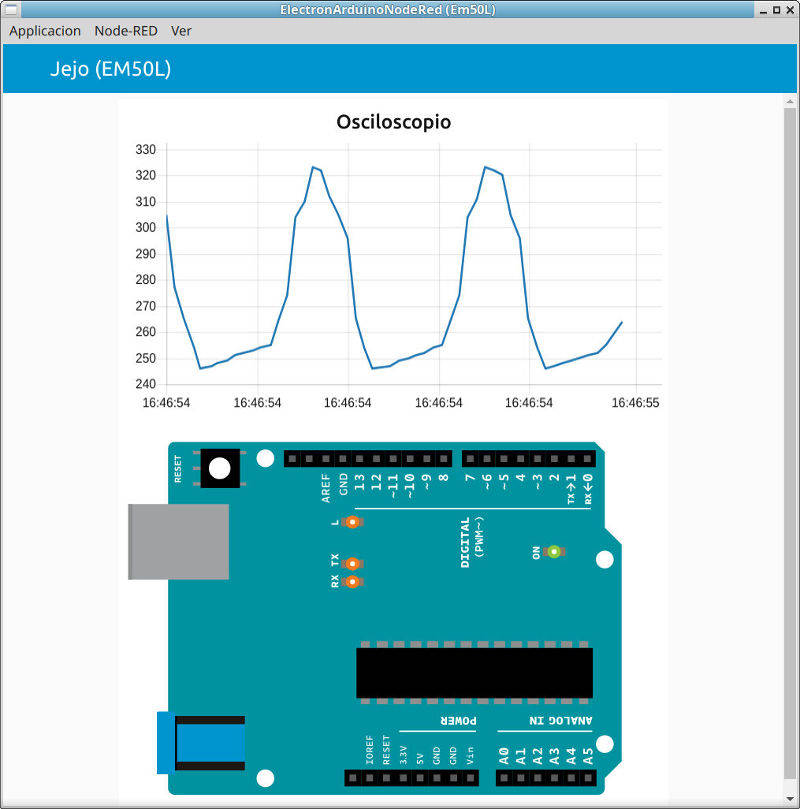

## Necesitaras lo siguiente
- Entorno Arduino.
- Arduino con Firmdata cargado.
- Aplicacion  [ElectronArduinoNodeRed] ()

## Pasos a seguir  

- ### Cargar StandarFirmData en Arduino
>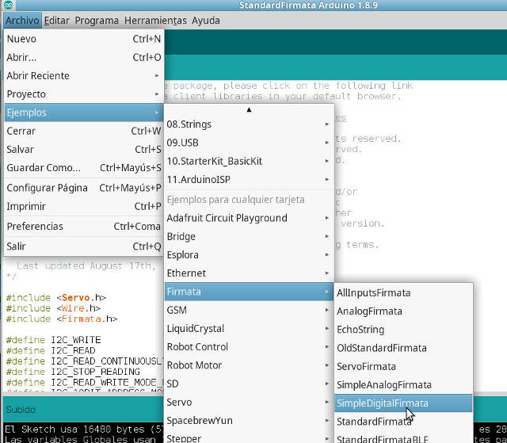  
>
>Nota:Comprobar puerto y modelo de placa antes de subir
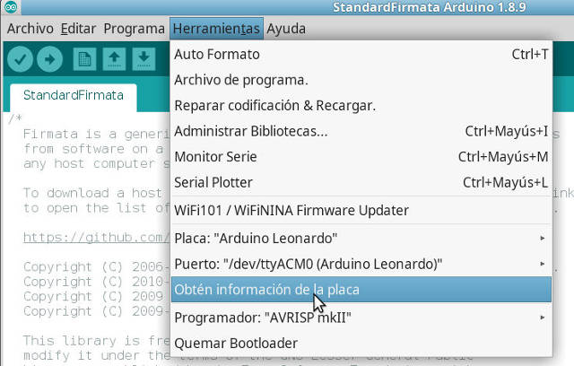 

- ### Abrir la aplicacion ElectronArduinoNodeRed e ir a editar codigo
>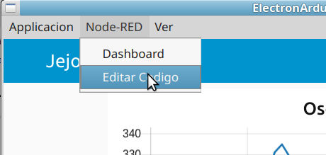 

- ### Insertar Pin Arduino  
 (Arrastrar y soltar elemento al tablero)
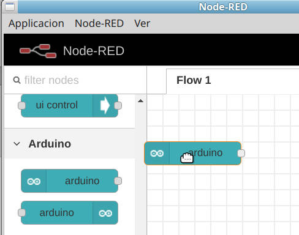 

- ### Configurar Pin Arduino  
(Doble click en el elemento)
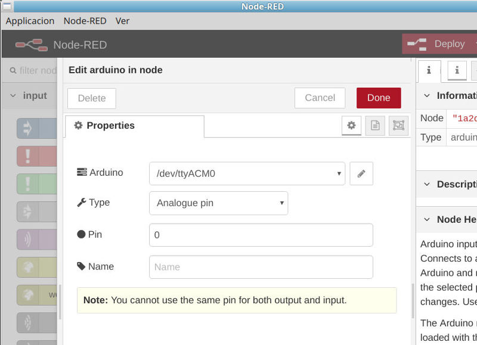 

- ### Insertar Grafica dashboard  
 (Arrastrar y soltar elemento al tablero)
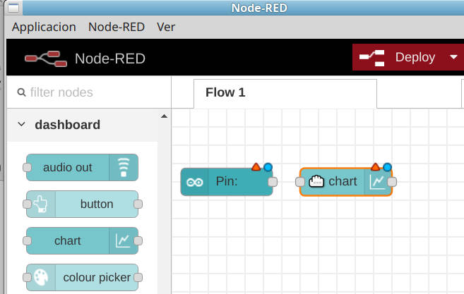 

- ### Configurar Grafica  
(Doble click en el elemento)
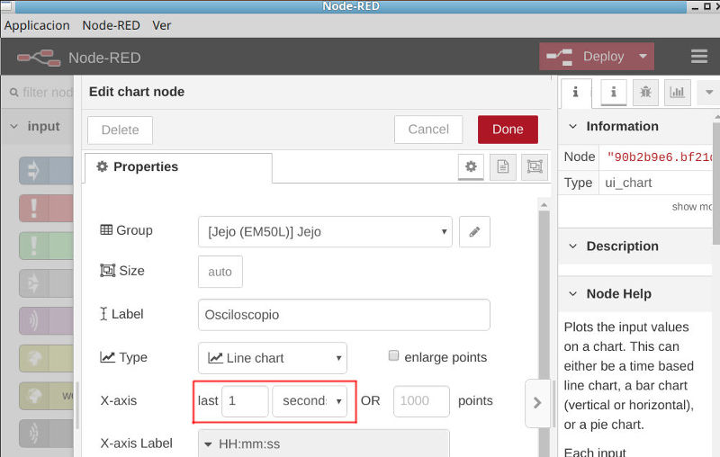 

- ### Conectar Nodos  
 (Arrastrar y desde un noto al otro con un conector)
 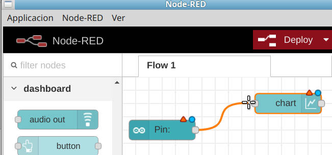 
 
 
 - ### Deploy  
 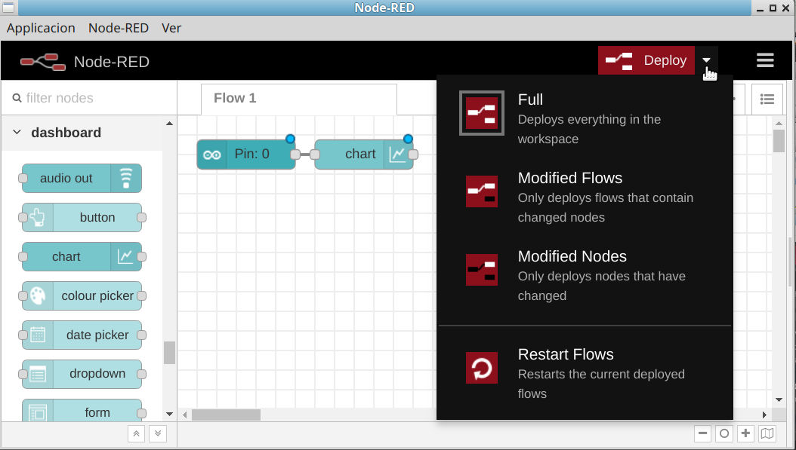 
 
 
  - ### Si todo ha ido bien  
  Deberiamos ver esto. 
  Deberian haber desaparecido los puntos rojos y azules encima de los nodos  
   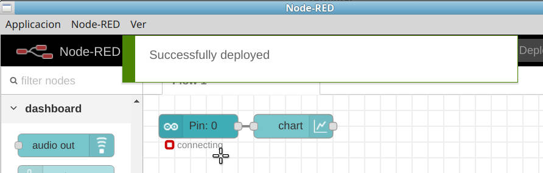
   
   
   - ### Conexion Arduino con Firmdata  
   Cuando conecte con el arduino si todo ha ido bien  
  Deberiamos ver conected debajo del nodo.  
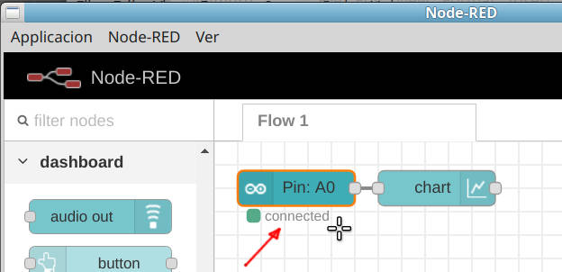 

 - ### Volver al dashboard
 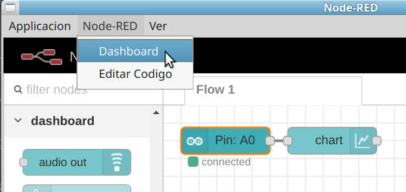 
 
 
 - ### Deberíamos ver esto.
 Las oscilaciones son por los pararitos de la red AC en la almientacion del arduino.   
 se ve algo parecido a uno onda sinuidal de 50Hz(hercios)
 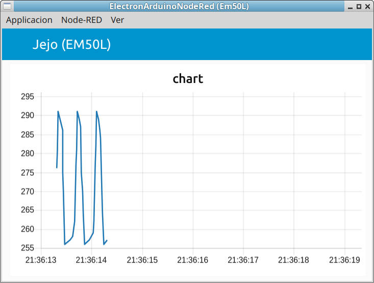 
 
## License [CC0 (Public Domain)](https://creativecommons.org/publicdomain/zero/1.0/)
<!--
## Ver Tambien
 - **Electron Node-RED Project which this project was forked from** - https://github.com/natcl/electron-node-red
 - **Stand-alone Starter Project** - https://github.com/dceejay/node-red-project-starter
 - **mpm serial port** - https://www.npmjs.com/package/serialport
- **node serial port** - https://serialport.io/
-->