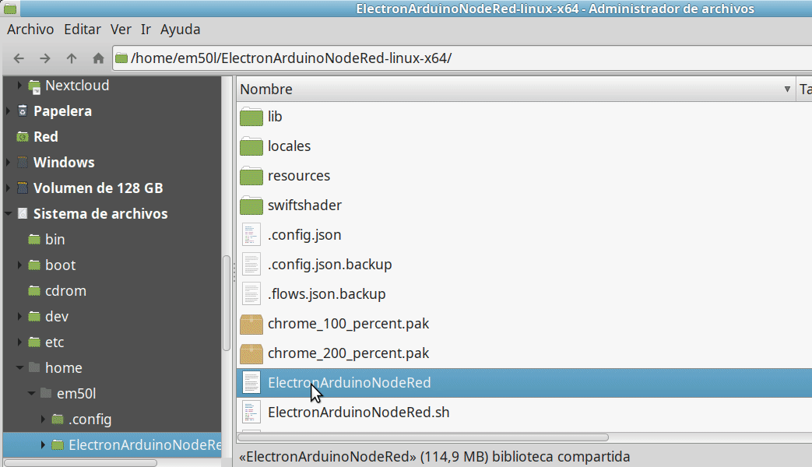
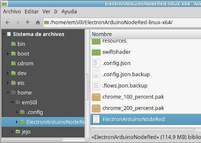
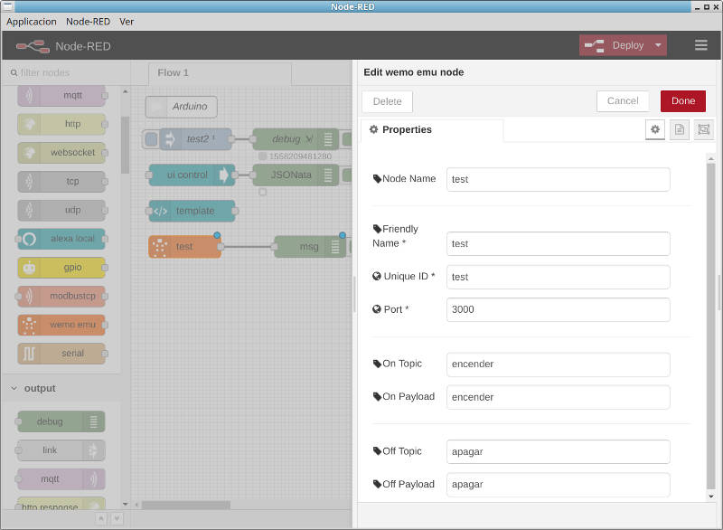
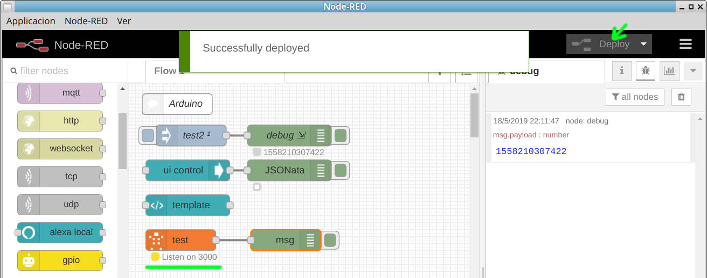
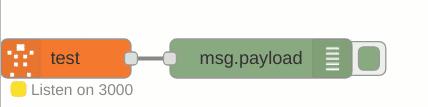

Aqui dejo un flujo para node red.  
que recoge y procesa comandos de voz de alexa.  
Ahora solo queda hacer con el comando lo que quieras.  
Persianas, luces, comandos pc, control arduino...
<!--more-->

<!-- https://www.w3schools.com/js/tryit.asp?filename=tryjs_intro_lightbulb -->
<!-- https://www.w3schools.com/howto/tryit.asp?filename=tryhow_js_toggle_hide_show -->

Animacion:

______________________________________

# Explicacion paso a paso.
______________________________________

## Necesitaras lo siguiente
- Aplicacion  ElectronArduinoNodeRed 
- O tener instalado node red y los modulos indicados (node-red-contrib-wemo-emulator)
- Un alexa operativo.
- Todos los equipos visibles en la misma red wifi. (si no alexa no podra comunicarse)

### 1) Abrir aplicacion  ElectronArduinoNodeRed

### 2) Arrastrar bloque wemo-emulator al tablero

**nota:**  
Para entrar en la configuracion hay que dar doble click en el bloque.

### 3) Parametrizarlo/configurarlo

- node name: test
- Friendly name: test
- Unique ID: test
- Port: 3000
- On topic: encender
- On Payload: encender
- Off topic: apagar
- Off Payload: apagar

### 4) Deploy / Deteccion

**Nota:** Despues de Configurar e implantar el bloque
Tendremos que pronunciar `Alexa Buscar dispositivos`  
Si los dos equipos el que esta corriendo el node-red y alexa estan en la misma red,  
Alexa lo detectara en unos 20Seg, y nos dira su nombre (`test')

### 5) Probar Respuesta a los comandos de voz 

Y ya  esta todo listo. solo nos queda probarlo.  
Como se ve en la imagen.   
al pronunciar `alexa encender test` vemos como cambia el estado del bloque a `on`  
y al pronunciar `alexa apagar test ` vemos como cambia el estado del bloque a `off`

## Enlaces 
Pagina del proyecto y el codigo.   
https://github.com/EM50L/ElectronArduinoNodeRed/   
Releases / Versiones   
https://github.com/EM50L/ElectronArduinoNodeRed/releases/   
Articulo en la pagina personal del autor.  
https://jejo.es/posts/osciloscopio_arduino/
 
 
 <!-- -->
